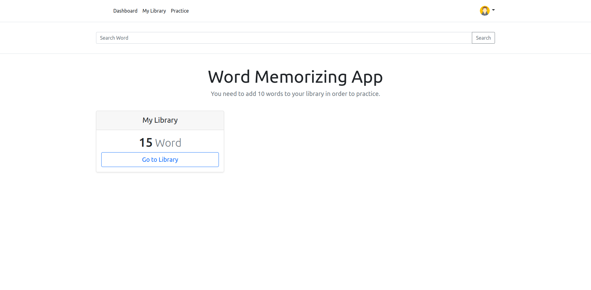
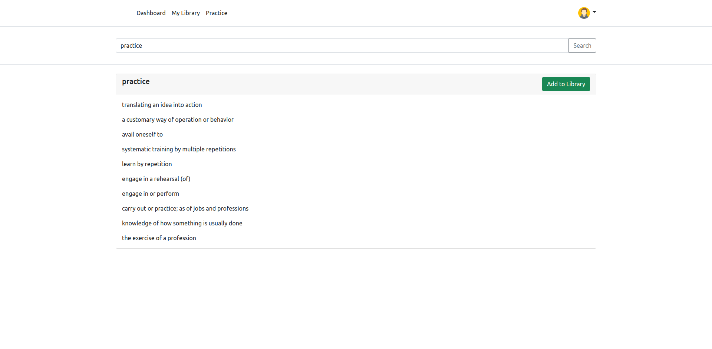
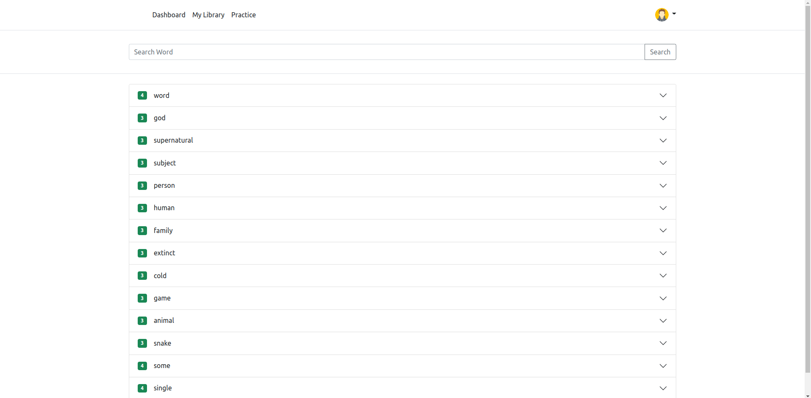
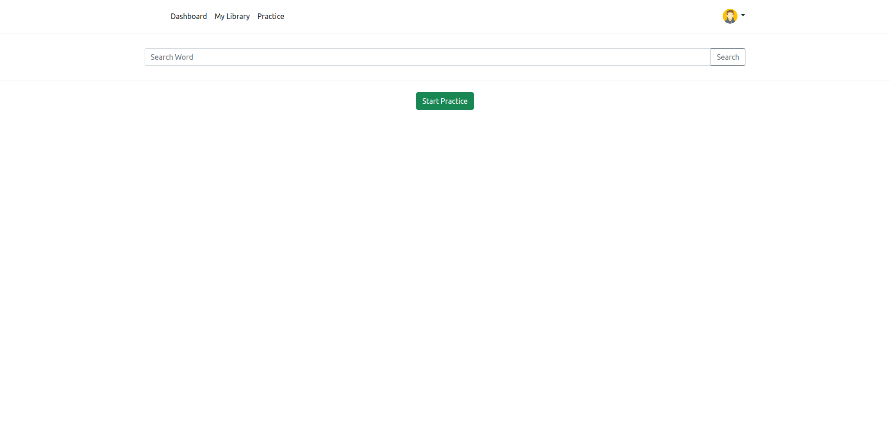
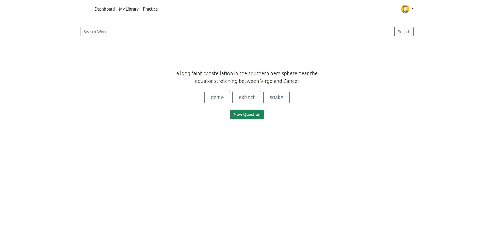
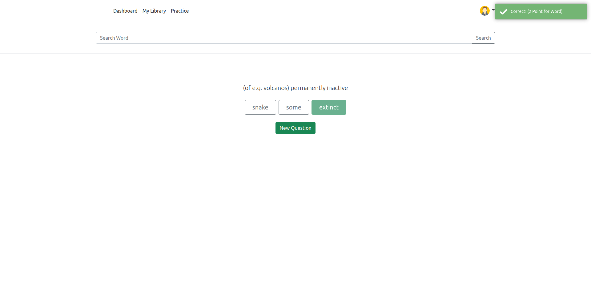
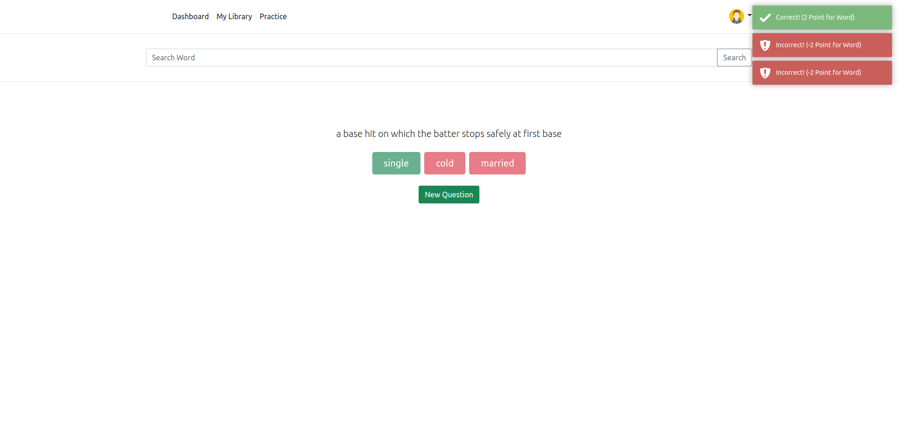

# Word-Memorizing-App
Word Memorizing App

## RUN
```
pip install -r requirements.txt
export RAPIDAPI_KEY=your_rapid_api_key
python run.py
```

#### Dashboard


#### Search


#### Library


#### Practice - 1


#### Practice - 2


#### Practice - 3


#### Practice - 4


